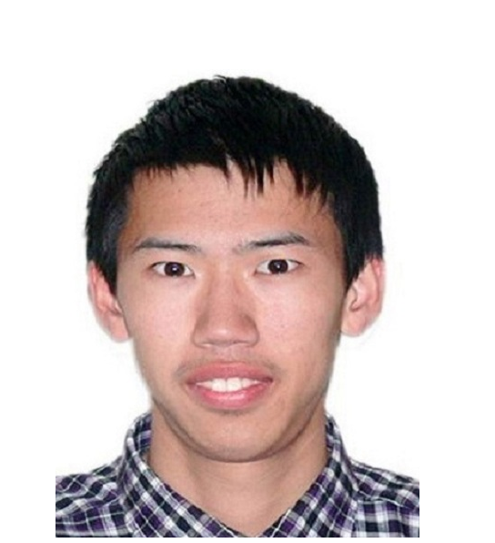
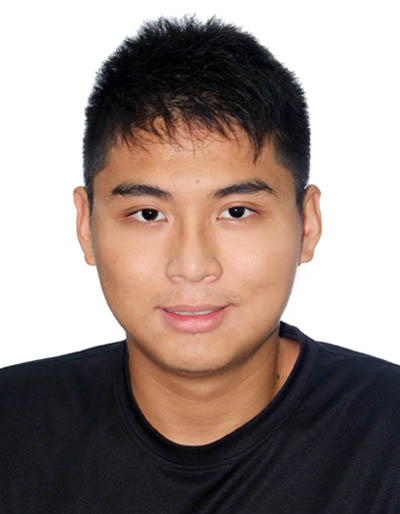

# About Us

Hello from the developers of Watodo! We are an international software engineering team from 3 countries: China, Singapore and Turkey. We are a team based in the [School of Computing, National University of Singapore](http://www.comp.nus.edu.sg).

## Project Team

#### [He Xing Darius](https://github.com/hesingon)  
 
Role: Team Lead, Deliverables and deadlines, Developer  

Components in charge of: logic, model, testing, storage, GUI design 

Features implemented: 
   * Make fields in AddCommand input optional 
   * AddCommand integration 
   * Time.java 
   * Start Time and End Time 

Code written:  
   * [functional codes](https://github.com/CS2103JAN2017-T15-B2/main/blob/master/collated/main/A0143873Y.md) 
   * [test codes](https://github.com/CS2103JAN2017-T15-B2/main/blob/master/collated/test/A0143873Y.md) 

Other major contributions: 
   * Set up Travis and Coveralls 
   * Initial Refactoring from Addressbook level 4 
   * Time Parsers package allowing alternative time formats 
   * Debugging travis errors 
   * Drafting class diagram of Logic component 

-----

#### [Li Wentong](http://github.com/Wentong-DST)  
 
Role: Developer, Integration, Scheduling and tracking, Final version software, some documentation  
Components in charge of: 
Features implemented:  
Code written: 
Other major contributions: 

-----

#### [Oguz Yuksek](http://github.com/yuksek)  
 
Role: Developer, Integration, Scheduling and tracking, Final version software, some documentation  
Components in charge of: 
Features implemented:  
Code written: 
Other major contributions: 

-----

#### [Lin Minhui](http://github.com/lmh1234)  
 
Role: Developer 
Components in charge of: 
Features implemented:  
Code written: 
Other major contributions: 

refer to http://www.comp.nus.edu.sg/~cs2103/AY1617S2/contents/AboutUs.md for format 
