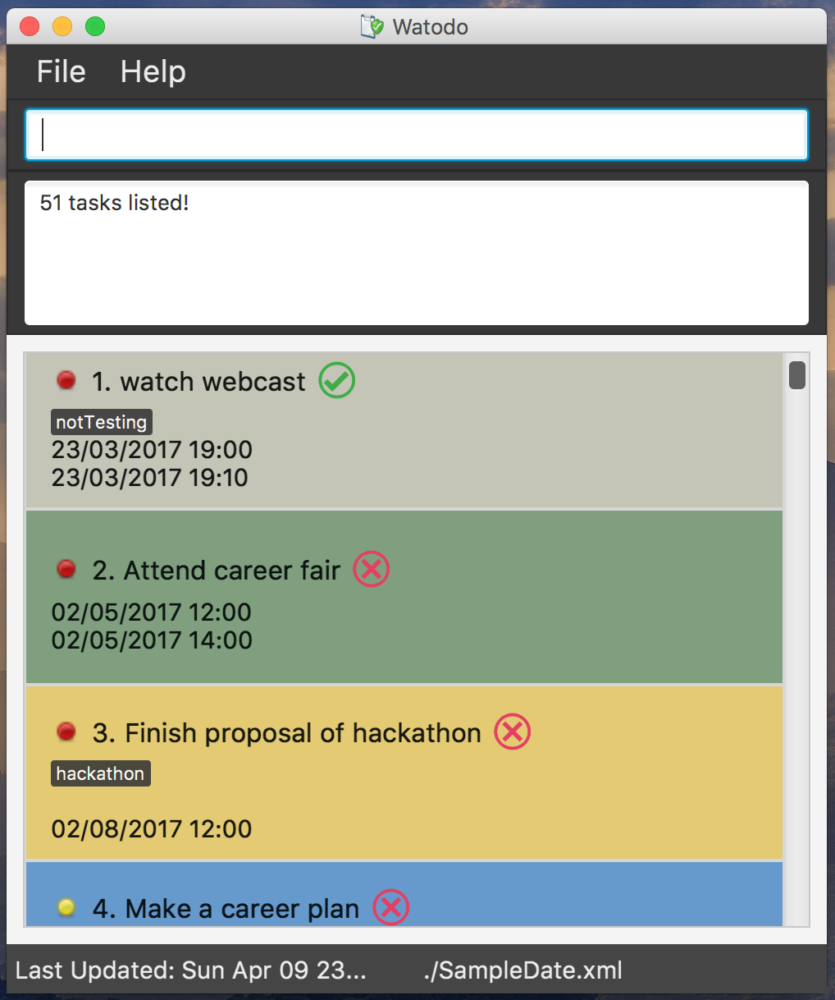

# Watodo - User Guide

By : `Team CS2103 T15-B2`  &nbsp;&nbsp;&nbsp;&nbsp; Since: `Jan 2017`  &nbsp;&nbsp;&nbsp;&nbsp; Licence: `MIT`

---

1. [Quick Start](#quick-start)
2. [Features](#features)
3. [FAQ](#faq)
4. [Command Summary](#command-summary)

## 1. Quick Start

0. Ensure you have Java version `1.8.0_60` or later installed in your Computer. 

   > Having any Java 8 version is not enough.  
   > This app will not work with earlier versions of Java 8.

1. Download the latest `taskmanager.jar` from the [releases](../../../releases) tab.
2. Copy the file to the folder you want to use as the home folder for your Task Manager.
3. Double-click the file to start the app. The GUI should appear in a few seconds.
   > 

4. Type the command in the command box and press <kbd>Enter</kbd> to execute it.  
   e.g. typing **`help`** and pressing <kbd>Enter</kbd> will open the help window.
5. Some example commands you can try:
   * **`list`** : lists all tasks
   * **`add`**` school camp from 3pm today to 5pm tomorrow :
     adds a school camp task to the Task Manager.
   * **`delete`**` 3` : deletes the 3rd task shown in the current list
   * **`exit`** : exits the app
6. Refer to the [Features](#features) section below for details of each command. 

## 2. Features

> **Command Format**
>
> * Words in `UPPER_CASE` are the parameters.
> * Items in `SQUARE_BRACKETS` are optional.
> * Items with `...` after them can have multiple instances.
> * Parameters can be in any order.

### 2.1. Viewing help : `help`

Format: `help`

> Help is also shown if you enter an incorrect command e.g. `abcd`

### 2.2. Adding a task: `add`

Adds a task to the Task Manager 
Standard format: `add [TASK-NAME] from/[DD/MM/YYYY] [HH:MM] to/[DD/MM/YYYY] [HH:MM] p/[priority] t/[KEY-WORD]...` 

> * After the command word 'add', all fields are optional except name must be entered.
> * Three types of keyword for priority field allowed: 'low', 'med' and 'high'
> * Task can have any number of tags (including 0)
> * Input field should strictly follow the given order

##### Supported Time Formats

| Time Format          | Example                |
|----------------------|------------------------|
| dd/MM/yyyy hh:mm     | 31/10/2017 16:30       |
| dd MMM yyyy hh.mma   | 31 Oct 2017 4.30pm     |
| yyyy-MM-dd hh.mma    | 2017-10-31 4.30pm      |
| today h.mma          | today 4.30pm           |
| tmr h.mma            | tmr 4.30pm             |

Examples:  
* `add meditate `
* `add complete tutorial 3 to/tmr 23.59pm`
* `add Train pokemons from/today 9.00am to/tmr 10pm p/high t/imaginary`

> * If a command includes the start time, it must have an end time, otherwise it is an invalid command.

### 2.3. Listing all tasks : `list`

Shows a list of all tasks in the Task Manager. 
Format: `list`

### 2.4. Editing a task : `edit`

Edits an existing task in the Task Manager 
Note: when editing the date & time of a task 
both date and time must be put, only format allowed is dd/MM/yyyy hh:mm. e.g. 31/10/2017 16:30
Format: `edit [INDEX] [TASK-NAME] from/[DD/MM/YYYY] [HH:MM] to/[DD/MM/YYYY] [HH:MM]p/[PRIORITY-LEVEL] t/[KEY-WORD]...`

> * Edits the task at the specified `INDEX`.
    The index refers to the index number shown in the last task listing. 
    The index **must be a positive integer** 1, 2, 3, ...
> * At least one of the optional fields must be provided.
> * Existing values will be updated to the input values.

Examples:

* `edit 1 from/23/03/2017 19:00` 
  Change name of task at index 1 to "go home"

* `edit 1 from/23/03/2017 19:00 to/23/03/2017 19:10 p/high` 
  Change start and end times of timed tasks
  
* `edit 1 newTaskName`
  Change the name of a task only

#####Converting the type of a task

Edit command can as well be used to convert the category of tasks. For instance, a todo task can be converted to a deadline task by editing the endTime of it. 

For example, a task with index 2 is a todo task. Entering the command below converts it into a deadline: 
`edit 2 to/23/04/2017 19:00`

To convert an Event task to a deadline task, the startTime of the task should be cancelled. This can be done by entering the following command, where we just leave the field after prefix "from/" empty. 
`edit 3 from/`

### 2.5. Finding all tasks containing any keyword in their name: `find`

Finds tasks whose names contain any of the given keywords. 
Format: `search [KEYWORD1]  ...`

> * Only the name is searched.
> * Only full words will be matched e.g. `Go Home` will not match `Going Home`

Examples:

* `find birthday` 
  Search for tasks with "birthday" in description
* `find birthday family` 
  Search for tasks with "birthday" and "family" in description

### 2.6. Deleting a task : `delete`

Deletes the specified task from the Task Manager. Irreversible, meaning this operation cannot be undone. 
Format: `delete [INDEX]`

> Deletes the task at the specified `INDEX`.  
> The index refers to the index number shown in the most recent listing. 
> The index **must be a positive integer** 1, 2, 3, ...

Examples:

* `delete 2` 
  Deletes the 2nd task in the Task Manager.

### 2.7. Clearing all entries : `clear`

Clears all entries from the Task Manager. 
Format: `clear`

> Irreversible.

### 2.8. Exiting the program : `exit`

Exits the program. 
Format: `exit`

### 2.9. Saving the data

Task Manager data are saved in the hard disk automatically after any command that changes the data. 
There is no need to save manually.

### 2.10. Undo command : `undo`

Undo the most recent command in the Task Manager. 
Format: `undo`

> Irreversible.

### 2.11. Mark command : `mark`

Mark a task an completed or incomplted in the Task Manager. 
Format: `mark 1 completed`

## 3. FAQ

**Q**: How do I transfer my data to another Computer? 
**A**: Install the app in the other computer and overwrite the empty data file it creates with
       the file that contains the data of your previous Task Manager folder.

## 4. Command Summary

* **Add**  `add NAME from/[s/START_DATE] [START_TIME]  TO/END_DATE] [END_TIME]...`  
  e.g. `add school camp from/03/04/2017 19:00 to/04/04/2017 20:00` 
  add a todo Task 
  `add get haircut` 
  add an event task 
  `add Attend CCA meeting from/today 3.00pm to/today 5.00pm`
  `add call Darius to/2017-04-07 3.00pm` 
 add a deadline task 
  `add call Oguz to/today 3.00pm` 
  `add call Min Hui to/tmr 3.00pm` 
 add a deadline task with tags
   `add call Wen Tong to/7 Apr 2017 3.00pm t/lunch`

* **Clear** : `clear`

* **Delete** : `delete INDEX`  
   e.g. `delete 3`

* **Search** : `search KEYWORD [MORE_KEYWORDS]`  
  e.g. `search birthday party`

* **List** : `list`  
  e.g. `list`

* **Help** : `help`  
  e.g. `help`

* **Edit** : `edit INDEX [NAME] [PARMAETER] [NEW VALUE]...`  
  e.g. `edit 1 -name go home`

* **Mark** : `mark [INDEX] [PARAMETER]`  
  e.g. `mark 1 completed`

* **Undo** : `undo`  
  e.g. `undo`
